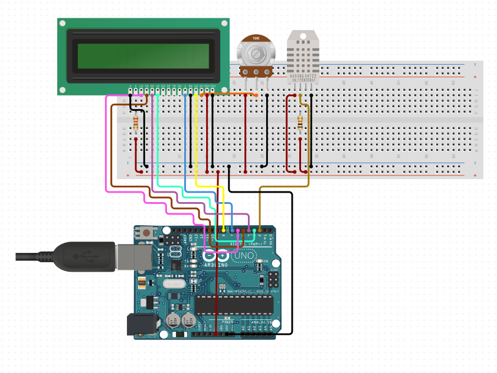

# Arduino Indoor-Thermometer

## General Info

---

Simple Arduino circuit, with LCD display and DHT temp. and humidity sensor.

## Needed

---

Needed for the project

- Arduino Uno - R3
- DHT22/11 Humidity and Temperature Sensor
- Rotary Potentiometer - 10k Ohm, Linear
- LCD 16x2
- 220 Ohm Resistor
- 10K Ohm Resistor
- 20x connectors

## Setup

---

- Note: 10K Ohm Resistor is connected to Potentiometer whereas 220 Ohm to LCD
- You need to have everything from the list above and connected like this:

  

- Now important!

DHT Sensor requires DHTLibrary. Now how to include it:

1.  Click on the download link to download .zip DHTLib (https://www.circuitbasics.com/wp-content/uploads/2015/10/DHTLib.zip), or download it directly from my project.
2.  Now open Arduino IDE
3.  Then go to Sketch>Include Library>Add .ZIP Library and select the DHTLib.zip file which you downloaded.

- LCD pins description can be found here: https://arduinogetstarted.com/tutorials/arduino-lcd
- Download source code and upload it on your arduino and you are good to go!
